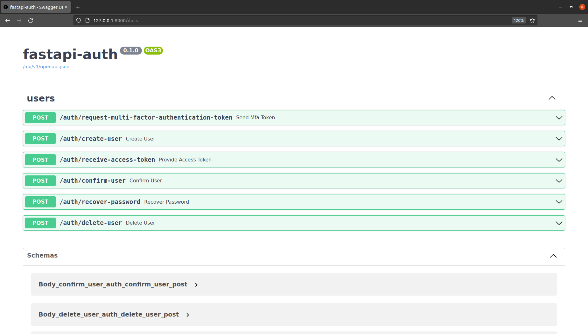
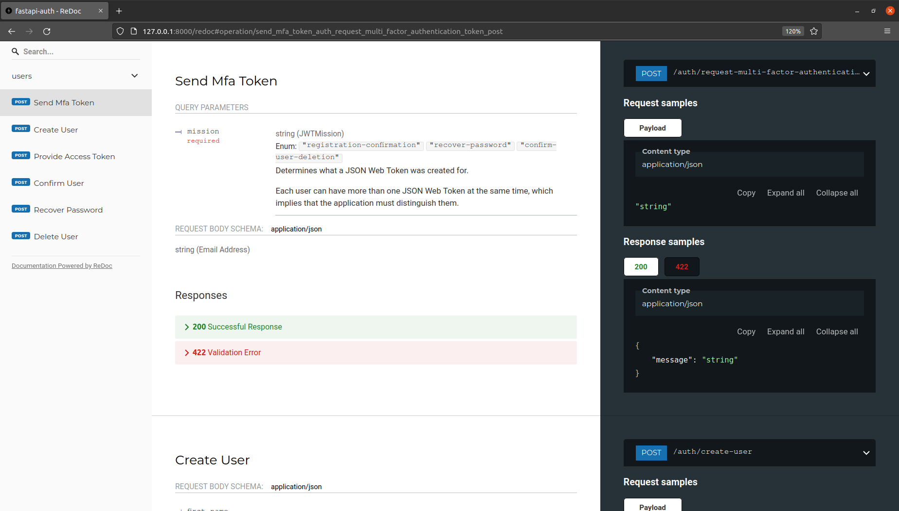

# fastapi-auth

A simple FastAPI authentication application.

### API documentation (Swagger)

### Alternative interactive documentation (ReDoc)

## Features
* Python [FastAPI](https://github.com/tiangolo/fastapi) backend:
    * **Fast:** Very high performance, on par with NodeJS and Go (thanks to Starlette and Pydantic).
    * **Intuitive:** Great editor support. Completion everywhere. Less time debugging.
    * **Easy:** Designed to be easy to use and learn. Less time reading docs.
    * **Short:** Minimize code duplication. Multiple features from each parameter declaration.
    * **Robust:** Get production-ready code. With automatic interactive documentation.
    * **Standards-based:** Based on (and fully compatible with) the open standards for APIs: [OpenAPI](https://github.com/OAI/OpenAPI-Specification) and [JSON Schema](https://json-schema.org/).
    * [Many other features](https://fastapi.tiangolo.com/features/) including automatic validation, serialization, interactive documentation, authentication with OAuth2 JWT tokens, etc.
* **SQLAlchemy** models, asynchronous engine.
* **Alembic** migrations.
* **Secure password** hashing using bcrypt algorithm.
* **Smart JWT system**: usage for authentication/multi-factor authentication.

# License
This project is under the terms of **MIT** license.
